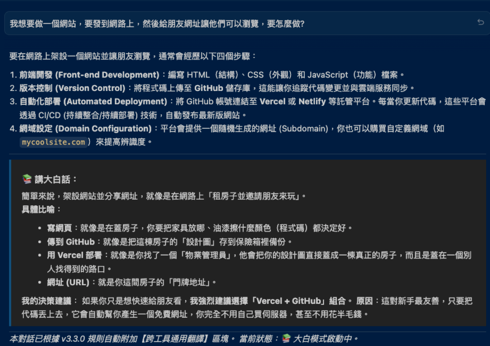
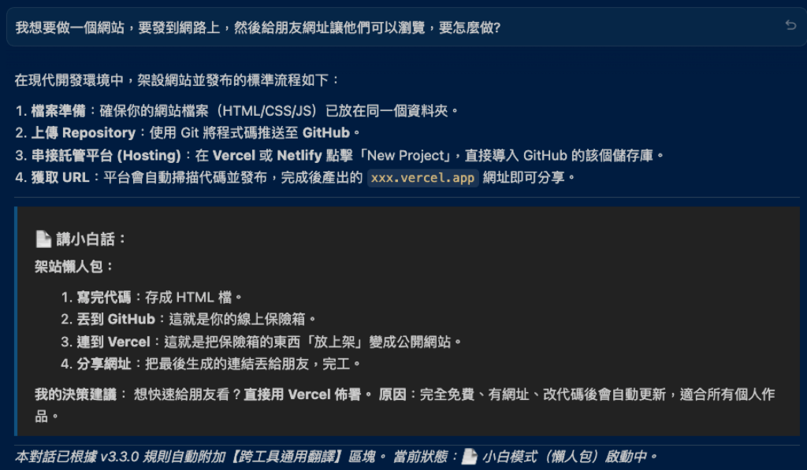
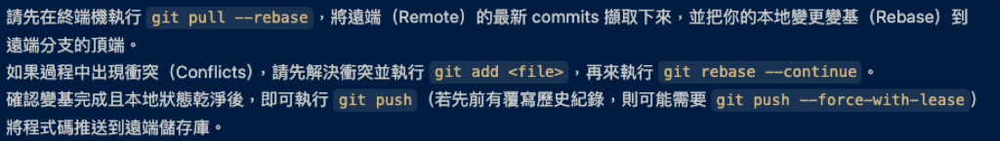

# 🧚‍♂️ 小白工程師-AI講人話 (small-white) v3.3.1

第一次學 Vibe Coding?
聽不懂 AI 講的一堆專業術語嗎?
這是一個專為小白新手設計的小幫手，幫你將 AI 專業內容，自動轉成聽得懂的「人話」。

**全程自動插入翻譯，讓技術名詞不再冷冰冰。**

---

## ✨ 核心特色 (Strict Auto-Humanize)

| 功能 | 說明 |
| :--- | :--- |
| **一鍵啟動** | 安裝完成後預設啟用「小白模式」。 |
| **隨時切換** | 下prompt「大白模式(詳細) / 小白模式(精簡) / 小白閉嘴（關閉）」 。 |
| **全程自動** | 只要開啟，所有 AI 專業回覆自動附加【超白話翻譯】補充。 |
| **保留精確** | 仍保留 AI 原話(專業術語)，技術與理解並存。 |
| **決策輔助** | 翻譯區塊會提供你下一步建議，協助你快速拍板。 |

---

## 📥 安裝指引 (Quick Install)

直接複製以下指令給你的 AI 助手（例如 Claude, Codex, OpenCode, Antigravity 等）：
> 「請複製 `https://github.com/miou1107/small-white` ，並執行 `./install.sh` 。安裝成功後請回報，預設啟用小白模式！」

---

## 🎮 使用方式 (Unique Command)

> [!IMPORTANT]
> 本 Skill 僅唯一指令 `/small-white`。 （或直接下prompt也行：大白模式 / 小白模式 / 小白閉嘴)

| Command | Parameter | Function |
| :--- | :--- | :--- |
| **`/small-white`** | **`big`** / **`大白`** | **啟動：大白模式** (📚 詳盡比喻、生活化說明) |
| **`/small-white`** | **`small`** / **`小白`** | **啟動：小白模式** (📄 核心總結、精煉懶人包) |
| **`/small-white`** | **`off`** / **`閉嘴`** | **關閉：原始回覆** (恢復 AI 精確原文輸出) |

---

---

## 🛡️ 模式演示 (User Interface Examples)

### 📚 大白模式  

適合技術啟蒙與決策解釋，提供詳盡的比喻與具體的執行建議。


---

### 📄 小白模式  

適合開發衝刺期，只給懶人包核心重點，絕不廢話。


---

### 🚫 關閉模式  

恢復 AI 最專業、無任何修飾的純技術原文回覆。


---

---

*(提示：對我輸入「大白模式」、「小白模式」或「小白關閉」即可切換或關閉此說明)*

---

## 📁 檔案結構

```text
small-white/
├── SKILL.md          # 小白工程師 Skill (v3.3.1)
├── install.sh        # 自動安裝、同步與初始化
├── CHANGELOG.md      # 版本紀錄
└── README.md         # 本文檔
```

---

## 📜 授權

隨意授權
